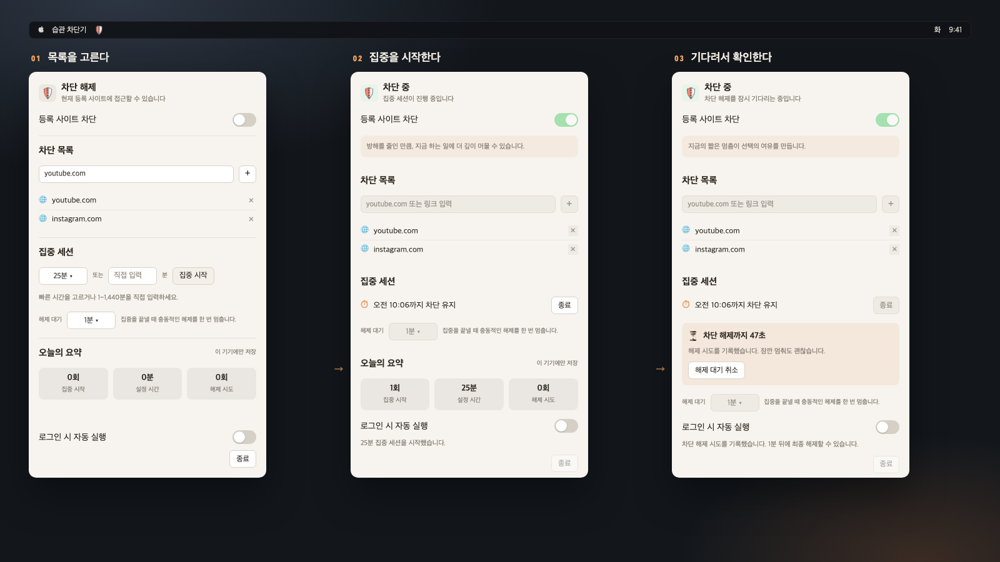

# HabitBlocker

> A macOS menu bar utility that adds friction to habitual website visits by blocking selected domains during focused work.

**HabitBlocker** lets you add domains or URLs such as `youtube.com` or a YouTube video URL, then control blocking from the macOS menu bar. It supports quick and custom focus sessions, a deliberate unlock wait for focus sessions, local activity summaries, and optional focus notifications.

[한국어 안내 보기](README_ko.md)

## Requirements

| Requirement | Details |
|---|---|
| Operating system | macOS 13 or later |
| Build tools | Xcode or Xcode Command Line Tools with Swift |
| Permissions | An administrator password is required only when applying or removing system-wide blocking rules. |

## Clone, Build, Test, and Run

Clone this repository, make the scripts executable, run the core tests, build the app bundle, and open it.

```zsh
git clone https://github.com/hyuunnn/HabitBlocker.git
cd HabitBlocker

chmod +x Scripts/build.sh Scripts/test.sh
./Scripts/test.sh
./Scripts/build.sh
open Build/HabitBlocker.app
```

The app appears as a shield icon in the macOS menu bar. Click the icon to open the popover.

> On the first blocking change, macOS asks for an administrator password. HabitBlocker changes the network proxy auto-configuration and does not modify `/etc/hosts`.

## How to Use

| Step | Action |
|---|---|
| 1 | Open the shield icon in the menu bar. |
| 2 | Add a domain like `youtube.com` or paste a full URL in **Blocked Sites**. |
| 3 | Edit the list only while blocking is off. The list locks once blocking is on. |
| 4 | Turn **Block Registered Sites** on to apply the rule immediately. Turn it off to remove the rule immediately. |
| 5 | Start a focus session only after blocking is off. When ending a session, finish the unlock wait before confirming. |

The standard block toggle is immediate. The unlock wait applies only when ending a focus session. The app cannot quit while blocking or a focus session is on.

## Usage Flow



*Usage flow based on the current menu: set the list, start a focus session, then complete the unlock wait when ending it.*

## Features

| Feature | Behavior |
|---|---|
| Menu bar control | Manage status, block lists, focus sessions, unlock waits, and summaries from a single SwiftUI popover. |
| Domain and URL input | Accepts domain names and full URLs, extracting the host safely. |
| System-wide PAC blocking | Applies a proxy auto-config (PAC) rule that routes blocked domains to a local listener on 127.0.0.1. Never reads or writes `/etc/hosts`. |
| Focus sessions | Can start only while blocking is off. Supports 25, 45, and 60 minute presets plus custom durations from 1 to 1,440 minutes. |
| Unlock wait | Always shown under Focus. The 30-second, 1-minute, or 5-minute delay can be changed only while blocking is off, and applies only when ending a focus session. |
| Local summary | Shows today’s focus starts, actual focused minutes, and unlock attempts. Activity data stays on this Mac and only today’s events are kept. |
| Focus messages | Displays encouragement inside the app and can send a macOS notification when permission is granted. |
| Launch at login | Uses the macOS login-item service to launch from the menu bar after sign-in. |

## Development Commands

| Command | Purpose |
|---|---|
| `./Scripts/test.sh` | Compiles and runs deterministic core tests. |
| `./Scripts/build.sh` | Creates and ad-hoc signs `Build/HabitBlocker.app`. |
| `open Build/HabitBlocker.app` | Opens the locally built menu bar app. |

## Automated Tests

The core test suite covers the logic that can be safely verified without administrator access:

| Area | Covered behavior |
|---|---|
| Domain normalization | URL host extraction, case normalization, IDN/punycode handling, and invalid-input rejection. |
| Hostname encoding | Converts stored domains to ASCII/punycode hosts for PAC. |
| PAC generation and matching | Evaluates the PAC with JavaScriptCore to verify subdomain blocking, suffix false-positive prevention, case/FQDN handling, and punycode (IDN) matching. |
| Network service parsing | Strips headers, errors, and disabled markers from `networksetup` output. |
| Admin script generation | Service-name quoting and escaping, previous proxy-setting restoration, and same-session rollback. |

## Project Structure

| Path | Responsibility |
|---|---|
| `Sources/HabitBlocker/HabitBlockerApp.swift` | App entry point and menu bar scene. |
| `Sources/HabitBlocker/MenuContentView.swift` | SwiftUI menu popover and visual components. |
| `Sources/HabitBlocker/BlockerStore.swift` | Blocking state, focus sessions, summaries, notifications, and local persistence. |
| `Sources/HabitBlocker/Models.swift` | Domain normalization plus blocking and activity data models. |
| `Sources/HabitBlocker/ProxyBlockService.swift` | PAC generation and serving, local reject listener, system proxy apply and restore. |
| `Sources/HabitBlocker/AdminShell.swift` | Wrapper for running privileged shell commands. |
| `Tests/HabitBlockerCoreTests.swift` | Deterministic core-logic tests. |
| `Scripts/build.sh` | Build and ad-hoc signing script. |
| `Scripts/test.sh` | Core-test build and execution script. |
| `Assets/habitblocker-usage-flow-v2.png` | Usage-flow visual shown in both README files. |

## Blocking Method and Limitations

HabitBlocker is a lightweight behavior-change tool, not a security product. Blocking uses the **system proxy auto-configuration (PAC)** mechanism and never reads or writes `/etc/hosts`.

### How it works

| Step | Description |
|---|---|
| 1 | The app builds a PAC script from the block list, and a loopback-only (127.0.0.1) listener serves that script. |
| 2 | Each network service's proxy auto-configuration points at this PAC URL. Previous proxy settings are saved to disk before any change. If the new PAC cannot be verified, the same administrator script restores those settings. Unblock succeeds only after the previous settings are confirmed. |
| 3 | The PAC routes only blocked domains to the local listener, which answers with a 403 block page. Everything else connects directly (DIRECT). |
| 4 | DNS and `/etc/hosts` are never used, so name resolution and local services stay intact. The worst case of a PAC misconfiguration is "blocking does not happen". |

Browsers' secure DNS (DoH) is not a bypass: the PAC decides by hostname before any DNS query happens, so it is more robust against secure DNS than a hosts-file approach.

### Limitations

| Limitation | Implication |
|---|---|
| App not running | The local listener that serves the PAC lives inside the app, so blocking is temporarily lifted while the app is fully quit. The settings remain in place and blocking resumes immediately on relaunch; focus timers are reconciled then too. Keep the menu bar app running for long blocking periods (launch-at-login is supported). |
| Clients that ignore the system proxy | Most browsers follow the system proxy, but some CLI tools (curl, etc.) and apps that force their own proxy settings can bypass it. |
| VPNs | VPN clients that ignore the system proxy can bypass it. |
| Existing browser connections | A tab that was already open may continue temporarily because browsers retain connections. Fully quit and reopen the browser to apply blocking to fresh connections. |
| Port conflict | If another program occupies port 47471, blocked sites may show the browser's default error page instead. |

Apple documents `MenuBarExtra` as a persistent menu bar control and notes that menu-bar-only utilities can use `LSUIElement` to remain out of the Dock and app switcher.[1] [2]

## References

[1]: https://developer.apple.com/documentation/swiftui/menubarextra "Apple Developer — MenuBarExtra"
[2]: https://developer.apple.com/documentation/swiftui/menubarextrastyle "Apple Developer — MenuBarExtraStyle"
